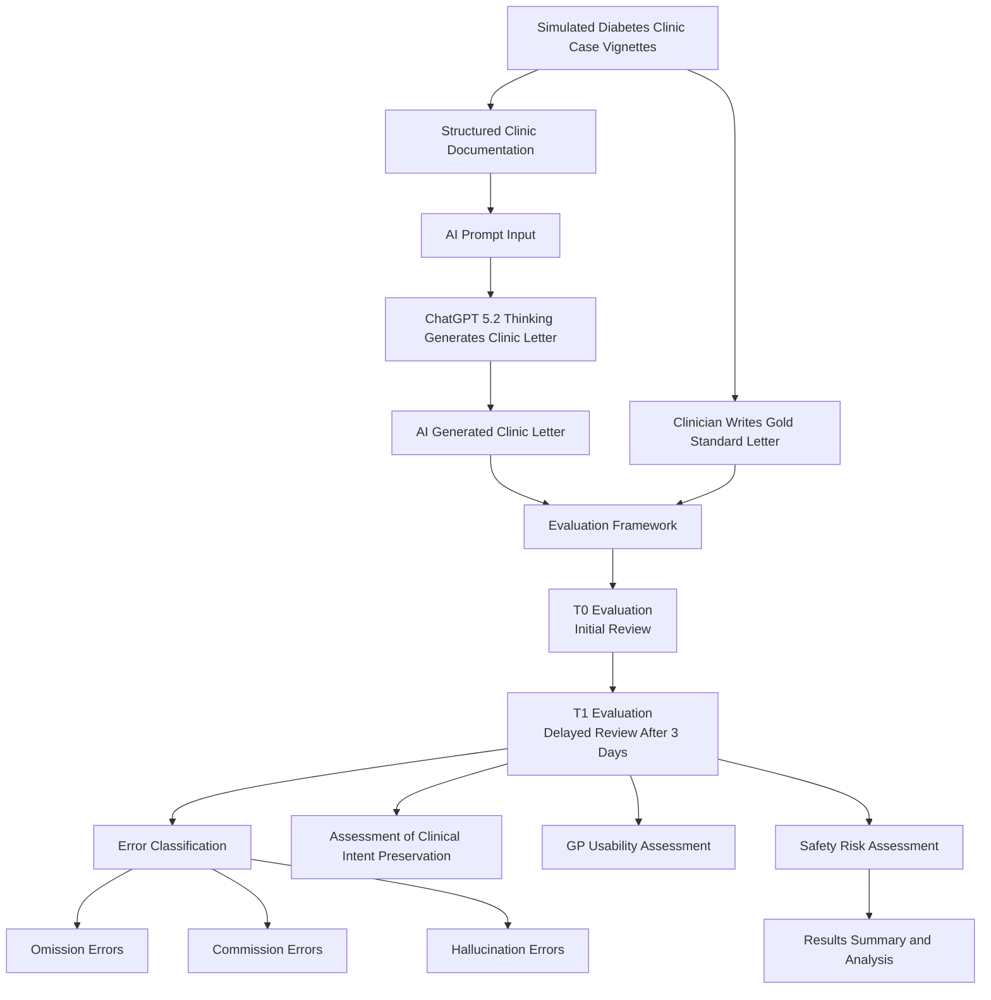

# AI-Generated Diabetes Clinic Letter Evaluation (Pilot)
Pilot study evaluating the safety, clinicalaccuracy and preservation of clinician intent in AI-generated diabetes outpatient clinic letters

## Overview
This repository contains information about a pilot study evaluating AI generated clinic letters intended for a patient’s GP following a visit to an outpatient diabetes clinic. 

The study aims to evaluate whether Clinician’s intent and clinical reasoning are preserved while generating such letters and whether clinical information is accurately transmitted between clinicians while avoiding unsafe omission, commission and hallucination errors.

This study uses a *simulated structured patient case vignette* and a *structured evaluation framework* focused on assessment of safety, omission risk, commission risk and preservation of clinical intent.

## Why This Matters for Clinical AI
Clinical documentation is a key part of medical care. It serves as a communication channel between clinicians. Errors in clinic letters can lead to change in management plan, delayed treatment and ultimately patient harm.

Large Language Models are becoming increasingly popular to generate clinical documentations. However, its safe deployment requires more than linguistic fluency. AI generated letters should also preserve clinician's intent, clinical reasoning and key safety information.

This pilot study evaluated whether structured clinical input combined with constrained prompt can allow AI generated clinic letters to accurately transmit clinical reasoning between clinicians while minimising safety risks.

## At a glance
- **Cases:** 5 simulated diabetes follow-up scenarios  
- **Model:** ChatGPT 5.2 Thinking  
- **Outputs:** GP clinic letters (AI vs clinician gold standard)  
- **Evaluation:** safety, omissions/commissions, intent preservation, delayed re-review (T1)  

## Research Question
Can an AI model safely generate clinic letters intended for patient’s GP following an outpatient clinic visit such that another clinician can understand:
-	What happened in the clinic
-	what was discussed and what decisions were made
-	Clinical reasoning behind such decision (where explicitly documented)
-	What actions GP needs to take (if any)

## Pilot Study Design
**Setting**- outpatient diabetes clinic (structured clinic notes reflecting real-world clinical documentation were used to generate clinic letters)
**Cases**- 5 simulated diabetes clinic follow up cases that reflects real world clinical scenarios and complexities
**Gold standard**- clinician authored gold standard letters were written for each case
**AI letters**- One AI generated clinic letter per case using standardised prompt and fixed model settings
**Evaluation timepoints**- T0- initial evaluation of letters T1- delayed evaluation of same letter a 3-day washout period (single rater delayed review)
**Evaluator**- Senior clinician (single reviewer)

## Study Workflow

## Key Findings
-	AI generated letters preserved clinician intent, patient safety information and GP action plans in this pilot study
-	Ai letters required minor edits in 60% of the cases compared to human letters (20%)
-	One Commission error and one omission error were identified
-	No moderate or serious safety issues detected
-	Delayed re-evaluation showed high intra rater stability with only one error reclassification after re-examination of the source data
Overall, with structured prompt and structured clinical data set, AI generated clinic letters were able to transmit core clinical reasoning between clinicians in this pilot dataset.

## AI generation
**Model**- ChatGPT 5.2 thinking
Prompt design:
-	Structured clinic documentation provided as input
-	Fixed output structure similar to gold standard letter
-	Rule based constraints were used such as use only the information present in the source data, do not invent diagnoses/ complications/ tests or treatments.

## Evaluation Framework
Each AI letter was assessed for:
-Clarity of the information
-GP usability (whether the letter can be used for GP communication and if action plan for GP is clear)
-missing critical clinical information or patient safety information
- preservation of Clinicians' intent 
-Omission, commission, hallucination error
-Clarity of follow up plan and responsibility allocation
-Interpretation drift
-Potential harm for patients if errors are actioned

## Repository Structure
-	Protocol- study description and methodology
-	Prompt- final prompt used for letter generation
-	cases- simulated structured clinical documentation
-	Gold standard letters- clinician authored standard of reference letters
-	AI letters- AI generated letters
-	Evaluation- completed evaluation sheet for gold standard letters and AI letters (across two timepoints T0 and T1)
-	Analysis table- data chart and summary table
-	Results- final figures and conclusion

## Key Outputs
This repository contains:
Simulated case vignette
Gold standard clinic letters
Standardised prompt used for AI letter generation
AI generated clinic letters
Evaluation sheet for evaluation of gold standard letters and AI generated letters across two time points (T0and T1)
Results table comparing AI vs gold standard letters and intra rater stability analysis

## Limitations
This pilot study used a small number of simulated cases and a single clinician evaluator. These finding therefore represent a methodological exploration rather than performance assessment of AI-generated clinical documentation.  

## Ethical/ Data statement
-	No real patient data
-	- simulated cases used inspired by real life complexities and caseload
-	This work is a pilot study of documentation safety and fidelity

## Reproducibility
All materials to reproduce the study are present in this repository

## How to cite
If you use or adapt this work, please cite:
- Author: Sharadiya Mitra
- Title: AI-Generated Diabetes Clinic Letter Evaluation (Pilot)
- Year: 2026
- Repository: https://github.com/sharadiyamitra/ai-diabetes-clinic-letter-evaluation

## Contact
For questions or collaboration, contact: sharadiyamitra@proton.me

